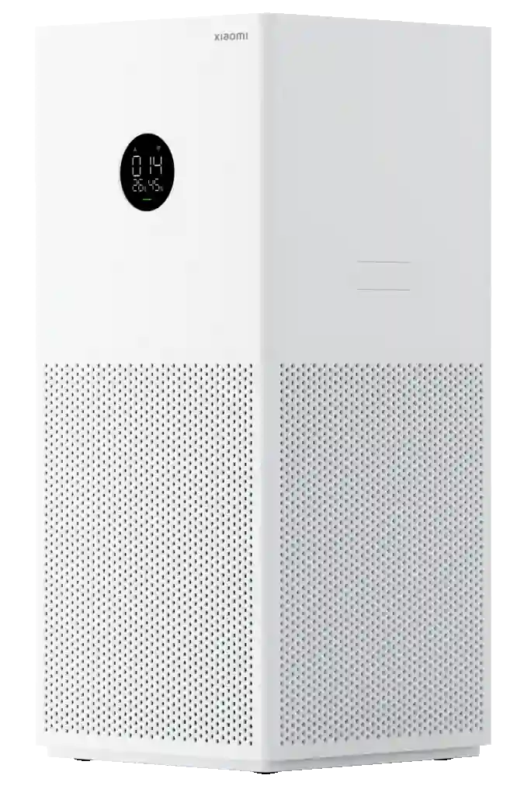
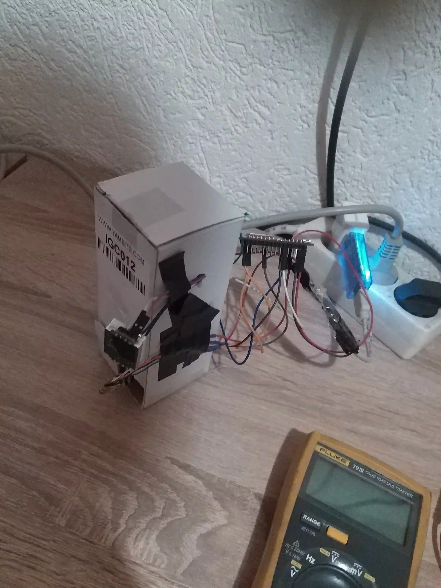
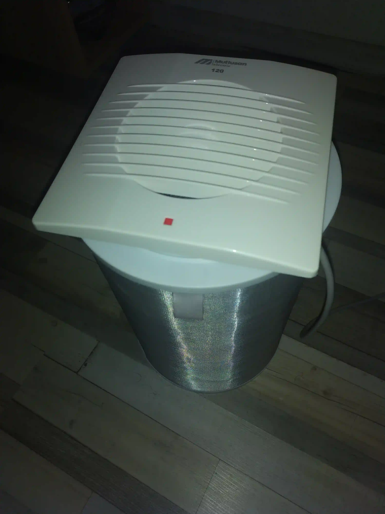
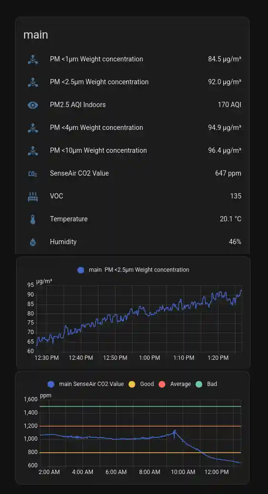

# An average smog-filled day in wintery Sarajevo

The story begins simply.

I got sick of the perpetual Sarajevoan smog-filled winters and I decided to tackle that by solving two issues:

- Figuring out pollution level in the room
- Purifying pollution in said room

And I did actually purchase a Mi Lite 4 purifier.

## The flaws of factory-built purifier

Honestly, the sensor wasn't as precise. Funnily enough it was, because of the software, not hardware.

Inside of it is Plantower PMS5003. Pretty solid sensor!

But I decided to go with Senserion SEN54, because in it I get very accurate with self cleaning and nice measurements of:

- PM1.0, PM2.5, PM4, PM10
- Temperature
- Humidity
- VOC

I also realized, since I am very often in my room and ventillation isn't optimal, nor do I like to ventillate, becaues of bad outdoor air, I also needed a CO2 monitor, which I decided on Senseair S88.

And with that I connected them via ESPHome (and one ESP8266) and crimped all the wires connected it all up and:

  
  
  
  

## The purifier part (seen above)

I realized, what if I just take the Mi's filter (which is like 6x cheaper than the price of the purifier itself) and just put on top of it a nice quality bathroom fan (with more pressure and not loud, 38dBA max).

And - it worked great.

And that's the story how I DIY'd the purifier.
