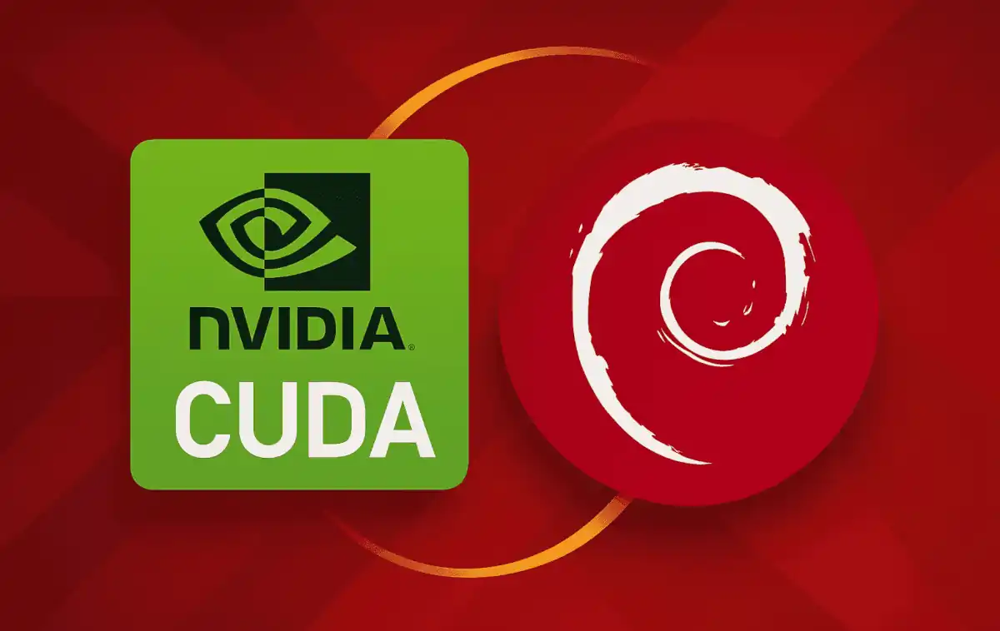

# The NVIDIA Driver Survival Story on Debian Trixie

So, I decided to run some advanced computations on my Debian machine. And to do such I needed better drivers. Simple enough, right?

## Phase 1: Fresh install - from Nouveau free stock to Nvidia Proprietary

Installed. It booted. It rendered a desktop. It did GPU things.

No CUDA, no real acceleration, but at least nothing was actively breaking. A stable baseline to destroy later. Then I added the keyring, hit apt update, got the packages, installed
nvidia-driver metapackage which promptly pulled latest and... Hello black screen.

---

## Phase 2: Fixing the Black screen, realizing NVIDIA 590+ dropped GTX

So, upon my realization that the 590 dropped GTX and only supports RTX (was pretty evident from nice error logs post-install, as well as the black screen, lol.
I switched to the official Debian 12 CUDA repository:

https://developer.download.nvidia.com/compute/cuda/repos/debian12/x86_64/

Purged with apt all Nvidia-related things and PINNED all higher packages to not install. Then, installed NVIDIA driver branch **580.x**.

At this point:

- CUDA works
- GPU acceleration works
- system is actually usable
- Wayland mostly behaves

Solid.

What was the most annoying was directly trying to downgrade from 590 back to 580, because I got:

- dependency conflicts everywhere
- APT refusing partial rollback
- meta-packages dragging wrong versions back in
- mixed driver states in `/usr/lib` and kernel modules

The actual fix was not “downgrade nicely”.

It was:

- purge broken 590 packages
- remove conflicting CUDA driver meta packages
- reinstall clean **580 branch from Debian 12 CUDA repo**
- ensure everything is pinned to 580 series

Once done:

- system stabilised again
- CUDA returned
- GPU stack became consistent

---

## Phase 3: Wayland breakage episode

After stabilization, I spent ~2 hours debugging Wayland issues.

Symptoms:

- session starts then crashes or hangs
- inconsistent rendering behavior
- GPU initialization not matching expectations

Root cause turned out to be:

- missing / misconfigured GDM / session backend expectations
- GPU modeset flags not consistently applied
- NVIDIA DRM configuration not aligned with Wayland requirements

---

## Required kernel + boot configuration

This is what ended up mattering:

### `/etc/default/grub`

```bash
GRUB_CMDLINE_LINUX_DEFAULT="quiet intel_iommu=on modprobe.blacklist=i915 kvm.ignore_msrs=1 vfio-pci.ids=8086:1912 snd-intel-dspcfg.dsp_driver=1 snd_hda_core.gpu_bind=0 nvidia-drm.modeset=1 nvidia-drm.fbdev=1"
```
After that, the system just worked ever since and pinning solved the upgrading issues! Yay!
