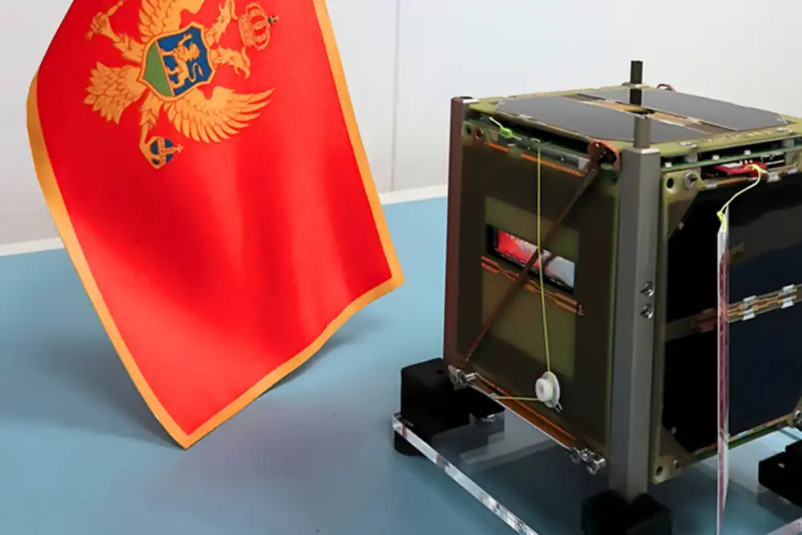
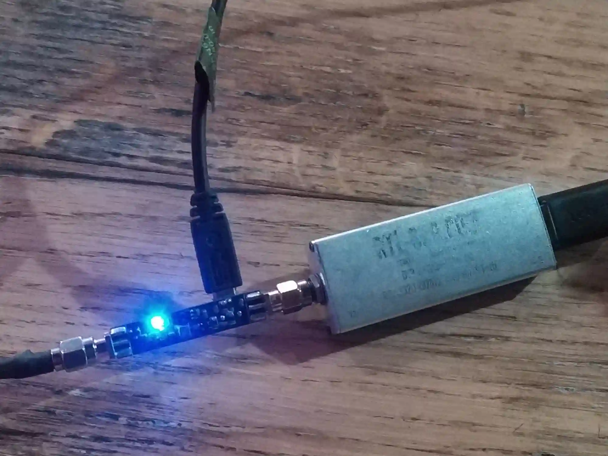
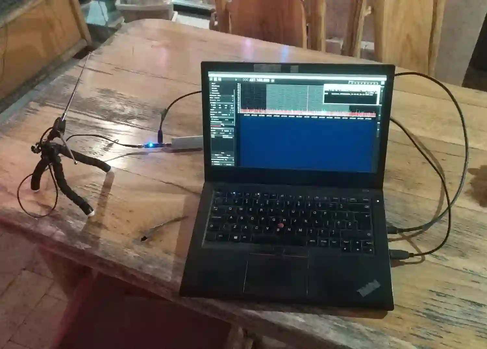

# Preface

I first came across the Luča project a few years back via news sites. :)

I followed the project, but the lanuch alas got postponed a few times and I..
Forgot about it.. rip.

Until one day I saw on the news!

Luča got launched! Woo!!!

I instantly looked for my 70cm turnstile and I realized - I had left it at the radio club!

The opportunity was too good to pass and I didn't feel like waiting a few days I decided to just roll with old school v-dipole and SAW filter + LNA into old trusty rtlsdr. :) (I did actually recieve it later with turnstile as well :P)

  
  
  
  

And.. it worked!

I captured GMSK bursts:

  <!-- Left: Image -->
  

  <!-- Right: Text -->
  

    <h2>GMSK Bursts</h2>
    

      They occur approximately ever 80 seconds The satellite whitepaper has not been published yet, but it has been hinted it's using AX25 4k8 GMSK. I did successfully decode it with GNURadio blocks first, but the data was a bit tough to extract, it could be done with `strings` though.
    

  

## Gnuradio example:

and I got the output:

<pre style="white-space: pre-wrap; word-break: break-word;">
<code>Container: 
    header = Container: 
        addresses = ListContainer: 
            Container: 
                callsign = u'R2ANF' (total 5)
                ssid = Container: 
                    ch = False
                    ssid = 0
                    extension = False
            Container: 
                callsign = u'RS90S' (total 5)
                ssid = Container: 
                    ch = False
                    ssid = 1
                    extension = True
        control = 0x00
        pid = 0xF0
    info = b'FB\x02\x00\x01\x00\x19\x00\r\x00\xff|"\x19W\x0e0{Si\x8b(\x02\x00`\t\x00\x00(\x00\x00\x1f\x00!\xed\x04\x00\x01\x000\x00\x0c\x10E\x0cU\x13u\x00%\x00M\x00F\x00\x00\x000\x00\x00\x00\x00\x00\x00\x00\x8a\x03q\x029\x03\xaf\x03\x00@\x00\x00\x08\x1f\x1f)\x02\x00\xb4!\x97Zb\x0c' (total 89)</code>
</pre>

_Though do keep in mind this turned out to be 2k4 FSK USP_

# What about SSTV and charged particle sensor?

Well.. I didn't see anyting else in the signal, nor was a whitepaper published about all of Luča's downlinks, so we wait for some info :)

And... an update also awaits us in the thought of SSTV commencing/commanding! :) As well as about the particle sensor it carries.. Would be very nice to be able to get that data as well..

Later I did get confirmed that the satellite operators in Montenegro Space Agency have to manually trigger SSTV. Charged particle sensor probably has a downlink somewhere, but curiosity remains on which frequency it is. Might be S band, that was common with previous Cubesats.

And that's the story of Luča! Very nice cubesat! Hope montengro launches many more! Awesome project ;D