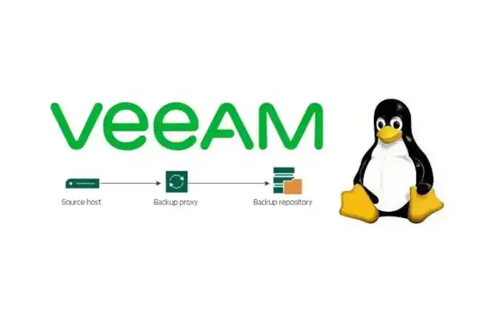

# Export Journey: From VIB/VBK Backups to Windows 10 via Veeam File-Level Restore

It started with a simple goal: recover specific pieces of data from a backup I did  and bring them cleanly into Linux (Debian).

Soon after fiddling with Wine, I realized that I needed a VM, so I made a Win10 virtual machine.

## Passing Through Drives and Files

The first step was making the backup data accessible inside the VM. This was done by passing through drive partition itself and the drive itself via SATA passthrough.

I also added a qcow2 volume, which I formatted within Windows 10 system to NTFS.

## Using Veeam File-Level Restore

Instead of initiating a full restore, the **Veeam File-Level Restore (FLR)** application was launched.

From within FLR:

* The incremenatl backup chain apeared nicely working ootb
* The VIB/VBK structure was interpreted automatically
* Individual files and directories became browsable like a live filesystem on C:\VeeamFLR

This made it possible to navigate deep into historical backups and select only the relevant data sets needed for recovery.

## Restoring to a Virtual NTFS Disk (the qcow2 one above)

The selected files from Veeam FLR were then restored directly onto this NTFS volume. This made it easy to transfer or reattach to other systems later.

## Outcome

The final result was a success.

* No full system restore required
* No overwriting existing environment

The QCOW2 NTFS volume served only temporaily, from which I used **rsync** to pull data further where I needed it and that's it!

---

*I will add more data and photos soon.*
