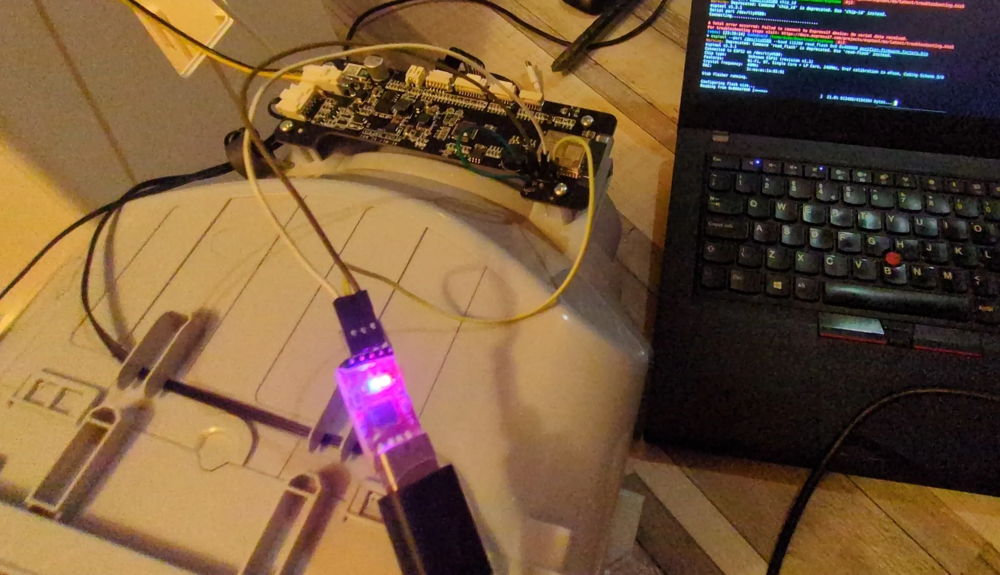

# - Preface

Hello! This is a quick and nice writeup of how I after having a bout of bad air after my hot air station offgassed a litle I realized that I really need some way to purify air apart from airing out the room! I decided to purchase a Xiaomi Air Purifier, specifically 4 Lite and how I decided on and liberated it from Xiaomi IoT ecosystem and made it run open source software!

------------
### *What you need*

*Let me just say before you read this that you do NOT need soldering for this, you just need an UART programmer, I used CP2102 USB-UART bridge, but you can use any microcontroller, Arduino, ESP32, Raspberry Pi, they all can act as UART programmerg. WARNING: Do keep in mind the UART **must** be 3.3V. 5V RX/TX logic will potentially damage the ESP32 chip. You also need three DuPont female to male cables and one DuPont male to male cable. I also used 1m USB extension cable for my CP2102 for easier handling and use. And some painter's tape to temporaily tape down the USB cable to the board so that it doesn't move while I flash. Reading flash takes ~5 minutes and you need to do it thrice, twice to backup and once afte write to verify. Write is a bit faster, about ~2 minutes.*

--------

# - The story

I've been a Home Assistant user for a few years now, very happy with it.
Recently I've gotten more interested in keeping the air in my environment healthier, as I realized I spend a lot of time in the room, but also I started soldering (with an air extractor though of course) and even with using air extractor I could still smell that some fumes were escaping and the room smelled bad and I even got a small headache. It took venting the room with all windows open for about ~4 hours for it to fully clean out.

So I decided - let me get an Air Purifier.

## - The options

I'm located in Bosnia and Herzegovina and Levoit, Coway and other popular brands of purifiers are quite hard to come by and very expensive. Also, DIY purifiers with good rectangular fan into a box with hepa filter behind it was also a bit hard to put together, as there's no real availability of true and tested HEPA filters.

I decided on Xiaomi air purifiers, as they're very plentiful here and so are filters for them. They last a year easily (the filters) and there's even a way to reset the filter :) Keep reading for how!

--------------

### - Looking for the device

Okay, so, I looked at the used market and I spotted a very cheap €50 lightly used second hand Xiaomi Air Purifier 4 Lite.

I decided to buy it! I was sulking a little bit, since I know Xiaomi system has their own IoT system through their app, which means I would have to get VLAN going for that too, isolate it on network properly and stuff. But I decided to look if perhaps anyone reverse engineered it or something, are there any photos of the main board. Perhaps an ESP32 could be dropped into it for remote control!

And.. I found the https://github.com/dhewg/esphome-miot project which.. Imagine my shock did exactly that and the main board.. **already has ESP32 on it with a separate STM32 controller!**

WOOOOOOO!

What a score, crazy! And there's even a great [contrib](https://github.com/dhewg/esphome-miot/blob/main/config/zhimi.airp.rmb1.yaml) by dhewg of it's sample config. Keep in mind it all comes originally from miot-spec specification: https://home.miot-spec.com/spec/zhimi.airp.rmb1

-----------
# - The installation

## 1. Generating the flash file that we will flash to the device

Before we flash we need to generate the file that we will flash.

We will do this in ESPHome app, it's really simple, just install ESPhome however you want, I personally used Docker. You can use Home Asssistant device builder too.

You take yaml from https://github.com/dhewg/esphome-miot/blob/main/config/zhimi.airp.rmb1.yaml

Pay attention to your secrets.yaml file for ESPHome (read ESPhome documentation).

You have:

- !secret api_encryption_key
- !secret ota_password
- !secret wifi_ssid
- !secret wifi_password
- !secret wifi_ap_password

That you can provide, change or generate/regenerate. Don't worry it's pretty easy and intuitive and documentation for this is plentiful.

## 2. Device disassembly

So, to disassemble the device it's not too hard, this video explained it pretty well:



Basically:

1. Unplug power supply cable from the device if connected
2. Separate the top part (the one with the fan, display and switches for turning on/off) from the bottom part of the device using side handles
3. Turn it upside down
4. Remove the dust cover plastic on side (I had to use screwdriver to push from top it's really tightly on)
5. Unscrew 8 screws, 4 in corners and 4 of fan corners (in center)
6. Push the grey plastic up (where the fan is - side where you just unscrewed screws) by pushing on side plastic push buttons (the ones you used to separate - unlock the top part from bottom), slide in some kind of very small prying tool or a very thin screwdriver on side and just gently keep raising it up till it gives way everywhere. It shouldn't take a lot of force. Keep in mind to not yank it up, there's a cable connected that you will need to remove from the main board.
7. Remove said cable, but DO NOT pull on it hard from the main board, the plastic housing is very fragile and prone to breakage. Very gently separate it, it took me 10 minutes of fiddling, twisting it slowly left right gently tugging it pushing it both down and up with my both hands (with fingernails). You'll know when you see it. Just be careful.
8. Now, put your hand in the middle of the fan unit (gray) and basically push it down (hold it down connected to ground) while pulling the white plastic housing up. White plastic housing will give and it will disconnect from the fan unit.
9. Disconnect the power (yellow/black 2 pin connector from the side of the main board) (you need to do this so that you can actually fully separate the white housing) - so that it's free to move.

That's it! No more disassembly needed. No soldering needed.

Now take your UART flasher and your DuPont wires and follow this guide how to flash. Read the guide once before doing it, there's images provided below, too.

1. Connect `GND` (black wire) to `GND` of your UART
2. `TX` (yellow wire) to `TX` of your UART (no need to cross RX/TX, the main board did it already, connect how it's literally written on board)
3. `RX` (red wire) to `RX` of your UART TTL adapter (keep in mind your RX/TX pins must be 3.3V as I already said)
4. Short the two pins labeled `BT` and `GND` (green wires) just above the UART pins to keep the ESP32 in bootloader mode
5. Power on the board (connect the yellow/black power cable we unplugged back to the main board and power it with DC adapter provided with the purifier)

Here's some images what to connect and how board looks:





Here's how to connect it as I wrote above:



[Thanks for initial guide and some photos to dhewg!](https://github.com/dhewg/esphome-miot/wiki/Xiaomi-Smart-Air-Purifier-4-Lite-(zhimi.airp.rmb1))

----------
## 3. Esptool and flashing

I installed `esptool` with pip. (in my case I used venv, since my system doesn't allow system pip packages, but you could also use your system package manager).

I also installed `picocom` from system package manager. to use it to verify that my model is indeed `zhimi.airp.rmb1` since this modification only works with international Xiaomi purifiers, but worry not, 99.9% of them are international model. You have to specifically buy somewhere in China or in Chinese-heavy marketplace such as Taobao to get Chinese version.

Now we use picom, keep in mind you might not have `/dev/ttyUSB0` but some other `/dev/` like `ttyACM0`or higher USB number like `USB1` or `ACM4` depending on devices you have connected. If you are on Linux of course. On Windows you have to use COM ports and it will always be higher.

**Picocom output:**

<div style="max-height: 400px; overflow-y: auto;">

```bash
> picocom -b 115200 /dev/ttyUSB0
picocom v3.1

port is        : /dev/ttyUSB0
flowcontrol    : none
baudrate is    : 115200
parity is      : none
databits are   : 8
stopbits are   : 1
escape is      : C-a
local echo is  : no
noinit is      : no
noreset is     : no
hangup is      : no
nolock is      : no
send_cmd is    : sz -vv
receive_cmd is : rz -vv -E
imap is        : 
omap is        : 
emap is        : crcrlf,delbs,
logfile is     : none
initstring     : none
exit_after is  : not set
exit is        : no

Type [C-a] [C-h] to see available commands
Terminal ready

rst:0x1 (POWERON_RESET),boot:0x13 (SPI_FAST_FLASH_BOOT)
configsip: 0, SPIWP:0xee
clk_drv:0x00,q_drv:0x00,d_drv:0x00,cs0_drv:0x00,hd_drv:0x00,wp_drv:0x00
mode:DIO, clock div:2
load:0x3fff0018,len:4
load:0x3fff001c,len:12
load:0x3fff0028,len:7540
load:0x40078000,len:14048
ho 0 tail 12 room 4
load:0x40080400,len:3392
entry 0x40080658
I (76) boot: Chip Revision: 1
I (77) boot_comm: chip revision: 1, min. bootloader chip revision: 0
I (42) boot: ESP-IDF d6a484cd3 2nd stage bootloader
I (42) boot: compile time 06:51:54
I (42) boot: Enabling RNG early entropy source...
I (47) boot: SPI Flash RID  : 0x684016
I (52) boot: SPI Flash  MF  : 0x68
I (56) boot: SPI Flash  ID  : 0x4016
I (60) boot: SPI Speed      : 40MHz
I (64) boot: SPI Mode       : DIO
I (68) boot: SPI Flash Size : 4MB
I (72) boot: Partition Table:
I (76) boot: ## Label            Usage          Type ST Offset   Length
I (83) boot:  0 nvs              WiFi data        01 02 00009000 00004000
I (90) boot:  1 otadata          OTA data         01 00 0000d000 00002000
I (98) boot:  2 phy_init         RF data          01 01 0000f000 00001000
I (105) boot:  3 miio_fw1         OTA app          00 10 00010000 00160000
I (113) boot:  4 miio_fw2         OTA app          00 11 00170000 00160000
I (121) boot:  5 test             test app         00 20 002d0000 00013000
I (128) boot:  6 mimcu            Unknown data     01 fd 002e3000 00100000
I (136) boot:  7 coredump         Unknown data     01 03 003e3000 00010000
I (143) boot:  8 minvs            Unknown data     01 fe 003f8000 00004000
I (151) boot: End of partition table
I (155) boot_comm: chip revision: 1, min. application chip revision: 0
I (162) esp_image: segment 0: paddr=0x00170020 vaddr=0x3f400020 size=0x30f34 (200500) map
I (248) esp_image: segment 1: paddr=0x001a0f5c vaddr=0x3ffbdb60 size=0x03be4 ( 15332) load
I (254) esp_image: segment 2: paddr=0x001a4b48 vaddr=0x3ffc1744 size=0x00794 (  1940) load
I (255) esp_image: segment 3: paddr=0x001a52e4 vaddr=0x40080000 size=0x00400 (  1024) load
I (264) esp_image: segment 4: paddr=0x001a56ec vaddr=0x40080400 size=0x0a924 ( 43300) load
I (291) esp_image: segment 5: paddr=0x001b0018 vaddr=0x400d0018 size=0xfbc38 (1031224) map
I (684) esp_image: segment 6: paddr=0x002abc58 vaddr=0x4008ad24 size=0x11dc0 ( 73152) load
I (732) boot: Loaded app from partition at offset 0x170000
I (733) boot: Disabling RNG early entropy source...
I (733) cpu_start: Pro cpu up.
I (737) cpu_start: Application information:
I (742) cpu_start: Project name:     miio_app
I (747) cpu_start: App version:      cd30deb
I (752) cpu_start: Compile time:     Jun 16 2025 20:42:42
I (758) cpu_start: ELF file SHA256:  213d7899cbe98668...
I (764) cpu_start: ESP-IDF:          v4.0.3-29-gf55b03467a
I (770) cpu_start: Single core mode
I (774) heap_init: Initializing. RAM available for dynamic allocation:
I (781) heap_init: At 3FFAFF10 len 000000F0 (0 KiB): DRAM
I (787) heap_init: At 3FFB6388 len 00001C78 (7 KiB): DRAM
I (793) heap_init: At 3FFB9A20 len 00004108 (16 KiB): DRAM
I (799) heap_init: At 3FFBDB5C len 00000004 (0 KiB): DRAM
I (806) heap_init: At 3FFCED08 len 000112F8 (68 KiB): DRAM
I (812) heap_init: At 3FFE0440 len 0001FBC0 (126 KiB): D/IRAM
I (818) heap_init: At 40078000 len 00008000 (32 KiB): IRAM
I (824) heap_init: At 4009CAE4 len 0000351C (13 KiB): IRAM
I (830) cpu_start: Pro cpu start user code
I (848) esp_core_dump_flash: Init core dump to flash
I (849) esp_core_dump_flash: Found partition 'coredump' @ 3e3000 65536 bytes
I (851) cpu_start: Starting scheduler on PRO CPU.
[E]: psm get log_level failed!
I (1066) BTDM_INIT: BT controller compile version [2c33a45]
I (1076) system_api: Base MAC address is not set, read default base MAC address from BLK0 of EFUSE
I (1076) phy_init: phy_version 4771,450c73b,Aug 16 2023,11:03:10
I (1086) phy_init: Support multiple PHY init data bins
I (1446) wifi:wifi driver task: 3ffdfa28, prio:23, stack:6656, core=0
I (1446) system_api: Base MAC address is not set, read default base MAC address from BLK0 of EFUSE
I (1446) system_api: Base MAC address is not set, read default base MAC address from BLK0 of EFUSE
I (1466) wifi:wifi firmware version: 83d1b87c1
I (1466) wifi:config NVS flash: enabled
I (1466) wifi:config nano formating: disabled
I (1466) wifi:Init data frame dynamic rx buffer num: 20
I (1476) wifi:Init management frame dynamic rx buffer num: 20
I (1476) wifi:Init management short buffer num: 32
I (1486) wifi:Init dynamic tx buffer num: 20
I (1486) wifi:Init static rx buffer size: 1600
I (1496) wifi:Init static rx buffer num: 10
I (1496) wifi:Init dynamic rx buffer num: 20
I (1496) wifi_init: rx ba win: 6
I (1506) wifi_init: tcpip mbox: 32
I (1506) wifi_init: udp mbox: 6
I (1506) wifi_init: tcp mbox: 6
I (1516) wifi_init: tcp tx win: 5744
I (1516) wifi_init: tcp rx win: 5744
I (1526) wifi_init: tcp mss: 1436
I (1526) wifi_init: WiFi IRAM OP enabled
I (1536) wifi_init: WiFi RX IRAM OP enabled
I (1546) wifi:set country: cc=EU schan=1 nchan=13 policy=1

I (1546) phy_init: phy_version 4771,450c73b,Aug 16 2023,11:03:10
I (1556) phy_init: Support multiple PHY init data bins
I (1566) wifi:mode : softAP (1e:ea:ac:1a:85:91)
I (1566) wifi:Total power save buffer number: 10
I (1566) wifi:Init max length of beacon: 752/752
I (1566) wifi:Init max length of beacon: 752/752
W (1576) phy_init: Use the default certification code beacuse EU doesn't have a certificate


_|      _|  _|_|_|  _|_|_|    _|_|  
_|_|  _|_|    _|      _|    _|    _|
_|  _|  _|    _|      _|    _|    _|
_|      _|    _|      _|    _|    _|
_|      _|  _|_|_|  _|_|_|    _|_|  
JENKINS BUILD NUMBER: N/A
BUILD TIME: Jun 16 2025,20:43:52
BUILT BY: N/A
MIIO APP VER: 2.2.10
MIIO MCU VER: 0058
MIIO DID: xxxxxxx
MIIO WIFI MAC: xxxxxxxx
MIIO MODEL: zhimi.airp.rmb1
ARCH TYPE: esp32,0x0000a601
ARCH VER: v4.0.3-29-gf55b03467a
FLASH INFO: manufacturer(0x68), memory type(0x40), capacity(0x16)

```

</div>


Indeed we confirm it's **MIIO MODEL: zhimi.airp.rmb1**

Perfect!

### - Now we do reads

-  Backup the full flash contents and put it somewhere safe:

 `esptool --port /dev/ttyUSB0 --baud 115200 read_flash 0x0 0x400000 purifier-firmware_flash_original.factory.bin`

```bash
> esptool --port /dev/ttyUSB0 --baud 115200 read_flash 0x0 0x400000 purifier-firmware_flash_original.factory.bin
Warning: Deprecated: Command 'read_flash' is deprecated. Use 'read-flash' instead.
esptool v5.3.1
Connected to ESP32 on /dev/ttyUSB0:
Chip type:          Unknown ESP32 (revision v1.1)
Features:           Wi-Fi, BT, Single Core + LP Core, 240MHz, Vref calibration in eFuse, Coding Scheme 3/4
Crystal frequency:  40MHz
MAC:                1c:ea:ac:1a:85:91

Stub flasher running.

Configuring flash size...
Read 4194304 bytes from 0x00000000 in 391.6 seconds (85.7 kbit/s) to 'purifier-firmware.factory2.bin'.

Hard resetting via RTS pin...

```

After we save the first one (the one above):
1. `purifier-firmware_flash_original.factory.bin`

Power off the board (unplug the DC conector), then power it back on (plug in DC connector) and read again, save 2nd, just to be safe and make sure there was no corruption:
2. `purifier-firmware_2_flash_original.factory.bin`

Verify their hashes match:

``` bash
> md5sum purifier-firmware*
d83b72b746d29a5ca42063d86a13ab9d purifier-firmware_flash_original.factory.bin
d83b72b746d29a5ca42063d86a13ab9d purifier-firmware_2_flash_original.factory.bin
```

If they don't match corruption happened during read, reseat cables and redo the process until they match.

### - Now we flash

Now we write our generated image:

`esptool --port /dev/ttyUSB0 --baud 115200 write_flash 0x0 purifier-firmware_flash_esphome.factory.bin`

```bash
> esptool --port /dev/ttyUSB0 --baud 115200 write_flash 0x0 purifier-firmware_flash_esphome.factory.bin 
Warning: Deprecated: Command 'write_flash' is deprecated. Use 'write-flash' instead.
esptool v5.3.1
Connected to ESP32 on /dev/ttyUSB0:
Chip type:          Unknown ESP32 (revision v1.1)
Features:           Wi-Fi, BT, Single Core + LP Core, 240MHz, Vref calibration in eFuse, Coding Scheme 3/4
Crystal frequency:  40MHz
MAC:                xxxxxxxx

Stub flasher is already running. No upload is necessary.

Configuring flash size...
Flash will be erased from 0x00000000 to 0x000ecfff...
Wrote 966960 bytes (633472 compressed) at 0x00000000 in 59.0 seconds (131.0 kbit/s).
Hash of data verified.

Hard resetting via RTS pin...
```

Then we power off the board (unplug DC) and power again and do our 3rd read in the same way we did our first two.

`esptool --port /dev/ttyUSB0 --baud 115200 read_flash 0x0 0x400000 toverifyfinalrwrite.bin`

### - Verify

And finally to verify we do:

```
> du --bytes *.bin
4194304	purifier-firmware.factory.bin
4194304	purifier-firmware.factory2.bin
966960	purifier-firmware_flash_esphome.factory.bin
4194304 toverifyfinalrwrite.bin

> cmp purifier-firmware_flash_esphome.factory.bin toverifyfinalrwrite.bin
cmp: EOF on ‘purifier-firmware_flash_esphome.factory.bin’ after byte 966960, in line 8734
```

Very nice! You see how it matches on same byte 966960 that is the length of our firmware we flashed. This proves write was good and verified individually by us and esptool post-write hash.

### - We finish!

That's it! Now your Purifier's main board is running ESPhome firmware.

Fully reassemble the device and power it on and in your esphome dashboard you can see the device and from then on you just do normal ESPHome and Home Asssistant integration, there's a lot of nice videos and posts on this, so I won't write about it. 

Here's how it looks in my home assistant:



---------
# Opinions on precision:
### - Particle sensor

The PM2.5 particle sensor is spot on. It's a Plantower PMS9103M It's reminded me very much of the very well known Plantower PMS5003. Very good sensor. Basic, but precise. Does what's needed.

### Temperature and Humidity:

No idea what humidity and temp sensors it uses, they claim it's:

"integrated digital NTC thermistor and capacitive relative humidity sensor module"

Well, from my experience, the humidity is very good. Spot on.

**Temperature, SUCKS.** It's off by 2C (to negative, reads too cold) compared to my Senserion SEN54, DHT22 and spirit liquid-in-glass wall thermometer. 

You can rely on it's humidity sensor, temperature, no. 

---------

Thanks for reading! :)